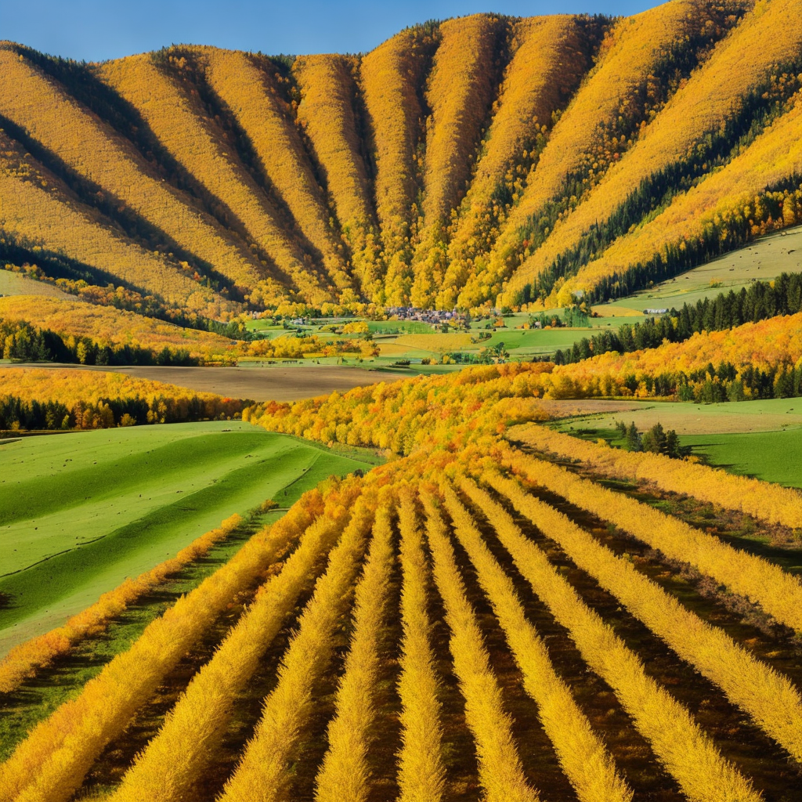

# ai-illusion
This is an illusion generator using stable diffusion.

`ai-illusion` is intended to be run locally with CUDA. It uses [Monster Labs QR Control Net](https://huggingface.co/monster-labs/control_v1p_sd15_qrcode_monster) 
and is heavily inspired from [Illusion Diffusion](https://huggingface.co/spaces/AP123/IllusionDiffusion).

